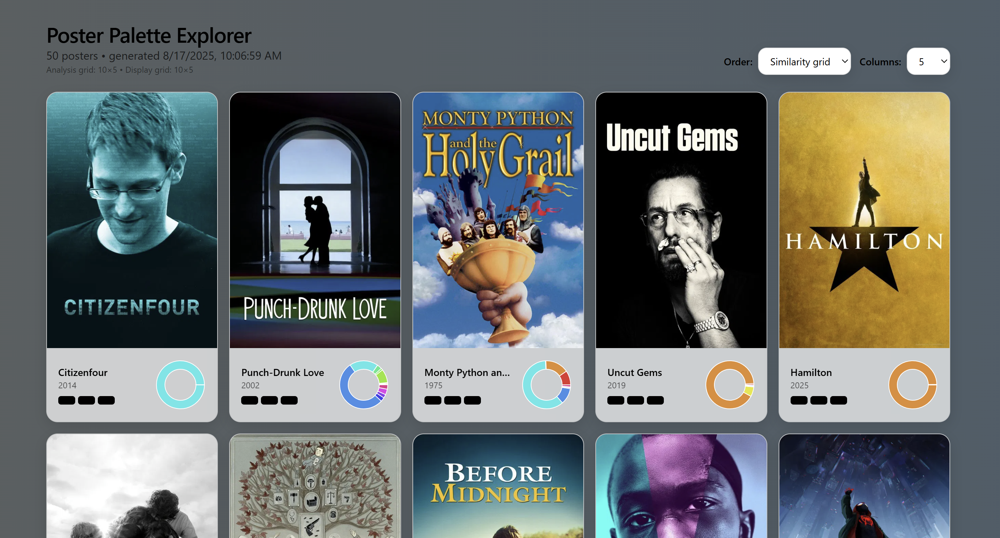

# Poster Palette Explorer



A project that analyzes movie poster color palettes and creates a beautiful interactive visualization. Takes your favorite movies, fetches poster images via the TMDb API, analyzes color motifs, and displays them in a smooth grid layout with dynamic background gradients.

## Features

- **Color Analysis**: Extracts dominant color palettes and hue histograms from movie posters
- **Smart Layout**: Uses PCA and optimal assignment to arrange posters in a visually pleasing similarity grid
- **Interactive UI**: React frontend with hover animations and sorting options
- **Dynamic Background**: Background gradient adapts to the colors of the poster grid
- **Mini Charts**: Each poster shows a compact hue distribution pie chart

## Tech Stack

- **Analysis**: Python + OpenCV + Scikit-learn + TMDb API
- **Frontend**: React + TypeScript + Vite + Tailwind CSS + Recharts + Framer Motion

## Setup

### 1. Get a TMDb API Key

Create a free API key at [https://www.themoviedb.org/](https://www.themoviedb.org/) and set it as an environment variable:

**macOS/Linux:**
```bash
export TMDB_API_KEY=your_api_key_here
```

**Windows PowerShell:**
```powershell
setx TMDB_API_KEY your_api_key_here
```
Then reopen your terminal.

### 2. Add Your Movies

Edit `analysis/input/movies.csv` with your favorite movies. You can use either TMDb IDs or movie titles with years:

```csv
TMDB_ID,Title,Year
,The Dark Knight,2008
,Her,2013
,Blade Runner 2049,2017
603,,
```

### 3. Run Analysis

```bash
cd analysis
python -m venv .venv && source .venv/bin/activate  # Windows: .venv\Scripts\activate
pip install -r requirements.txt
python color_analysis.py --csv input/movies.csv --rows 5 --cols 10 --k 5 --out ../frontend/public/posters.json
```

### 4. Start Frontend

```bash
cd ../frontend
npm install
npm run dev
```

Visit the printed localhost URL to see your poster palette explorer!

## Project Structure

```
poster-palette-explorer/
├── analysis/                 # Python analysis (no server needed)
│   ├── input/
│   │   └── movies.csv       # Your movie list
│   ├── color_analysis.py    # Main analysis script
│   ├── requirements.txt
│   └── README.md
├── frontend/                # React frontend
│   ├── public/
│   │   └── posters.json    # Generated by analysis
│   ├── src/
│   │   ├── App.tsx
│   │   ├── main.tsx
│   │   ├── components/
│   │   │   ├── PosterCard.tsx
│   │   │   └── HueChart.tsx
│   │   └── styles/
│   │       └── index.css
│   ├── package.json
│   └── [config files...]
└── README.md
```

## How It Works

1. **Data Collection**: Fetches movie metadata and poster images from TMDb API
2. **Color Analysis**: 
   - Extracts average RGB and LAB color values
   - Generates 5-color dominant palette using K-means clustering
   - Creates 12-bin hue histogram weighted by saturation×value
3. **Similarity Layout**: Uses PCA on hue signatures to create 2D embedding, then optimal assignment to grid positions
4. **Visualization**: React app renders the grid with smooth animations and dynamic backgrounds

## Deployment

Build for production:

```bash
cd frontend
npm run build
```

Deploy the `dist/` folder to any static hosting service (GitHub Pages, Netlify, Vercel, etc.).

## Legal Notes

- Uses TMDb API with proper attribution
- Poster images remain hosted by TMDb (not bundled in repo)
- Respects TMDb Terms of Service

---

Built with ❤️ using TMDb data. This product uses the TMDb API but is not endorsed or certified by TMDb.
